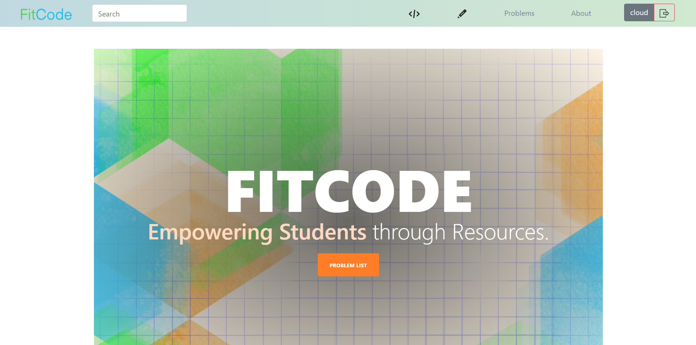
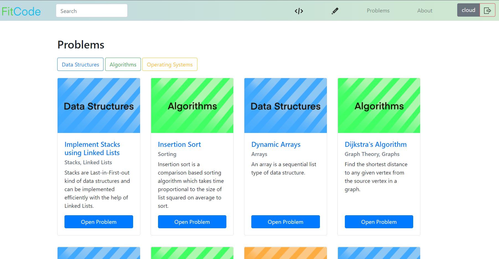
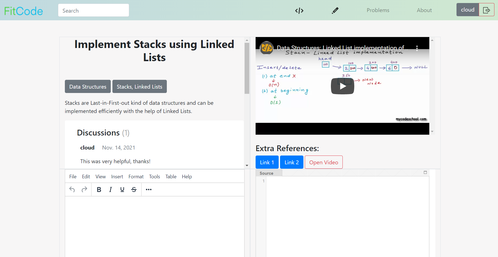
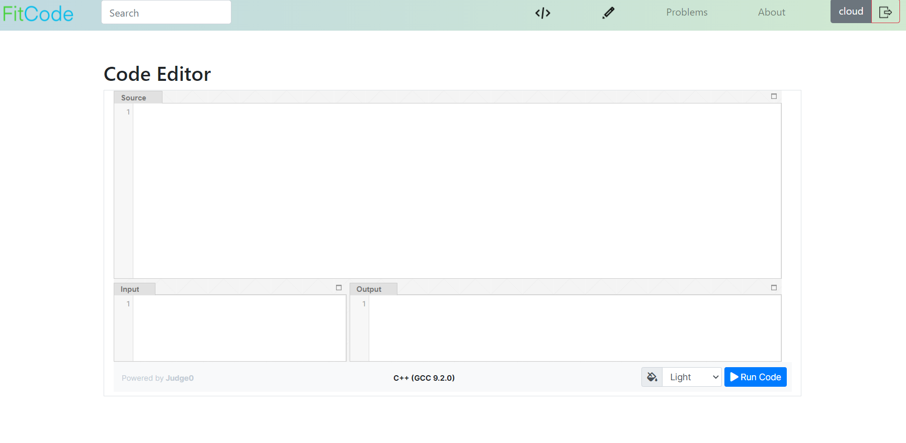
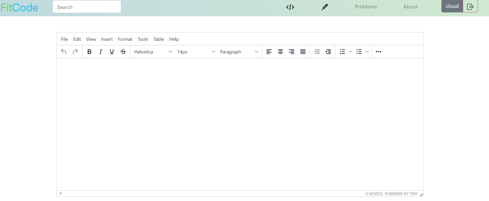

# FitCode
### _Empowering students through resources._

  
  

FitCode boasts of a platform where users can find a plethora of quality tried-and-tested resources on computer science related fields; and code, take notes and discuss them, all at one place.
### Try it out:
[FitCode](https://fitcode-tech.herokuapp.com/)

FitCode has been deployed via [Heroku](https://dashboard.heroku.com/). Click on the link above to check it out, or go to [https://fitcode-tech.herokuapp.com/](https://fitcode-tech.herokuapp.com/)
## Features

- Browse through problems ranging across a myriad of subjects and topics
- Powerful querying of the database has been implemented to facilitate ease of search
- Want to take notes while styding? [TinyMCE](https://www.tiny.cloud/)'s editor has been embedded for just that!
- Want to put your skills to the test and code right then and there? [Judge0](https://judge0.com/)'s C++ editor will let you do that!
- Concepts still not clear? Worry not, the discussion section will let you post your doubts and ask other users for help!
- Clean and distraction free UI.

## Screenshots

  
  <em>FitCode Home</em>
   
  
  <em>Problem List. You can search the database using the form in the navbar too.</em>
   
  
  <em>Problem Details Page. You can watch the video, discuss in the comments section, take notes and code all in one page!</em>
   
  
  <em>A code editor, powered by Jugde0!</em>
   
  
  <em>A text editor, run by TinyMCE!</em>

## Database

The website utitiles a Postgresql database in the backend.
Brief details of the models used in the database are as follows.

| S. No. | Model  | Details
| ------ | ------ | -----
| 1. | User | Used for account management.
| 2. | Problem| Used for storing the actual problem.
| 3. | Comment | Used in the discussion section. Has user and problem as foriegn keys.
| 4. | ProblemURL | Used to store extra links against each problem. Has problem as foreign key.

### Querying
Django's queryset and filtering is used to implement an advanced and robust quering system.

## Docker

The entire local development was done in a docker container.
 - Dockerfile
 - docker-compose.yml

For production, I shifted to a different image, for security.
- Dockerfile
- docker-compose-prod.yml

For heroku deployment, an image of a heroku container was used:
- heroku.yml

## Security
The website can deal with most of the threats to securit by utilising Django's core functionality. Some of the ways in which it handles security are:
- HTTPS/SSL (By SECURE_SSL_REDIRECT in settings.py)
- HTTP Strict Transport Security (HSTS)
- SESSION and CSRF Cookie Security

## Account Management
- Accounts are both username and email unique.
- Simple Mail Transfer Protocol is used to handle account confirmation and password changes.

## Testing
Units tests have been done on each and every model, template and views. Each app's test suite can be found at it's tests.py.

## Motivation
 As I also say on the [website](https://fitcode-tech.herokuapp.com/about/), 

> FitCode is a platform created with the ultimate goal of helping students find the very best amongst all the resources available on the vast internet.

> Often times we find ourselves looking for resources on a certain problem and end up spending hours and hours online clicking through links without finding that one nook of the internet which will clarify our concepts.

> The above describes my own experience as a student to a T. The resources presented in here are the ones which "solved the puzzle" for me. They are how the concepts finally clicked. FitCode is my way of sharing these with other students.

> Finally, I do understand that what worked for me will not necessarily work for others. To that end, each problem has a discussions sections in which students are encouraged to ask doubts and share their own resources.

Thank you for using FitCode and Happy Coding!
